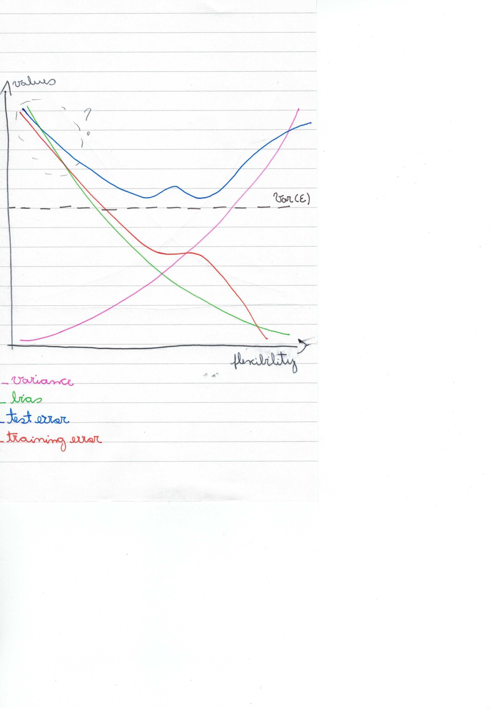

**1.**
(a) Better. As the level of flexibility increases, the curve fits the observed data more closely.
(b) Worse. Flexible statistical learning could lead to over-fitting.
(c) Better. It would not be possible to produce an accurate estimate using inflexible method. More degrees of freedom = more flexible.
(d) Worse. More flexible statistical methods have higher variance.

**2.**
(a) Regression problem. Inference: quantitative output of CEO salary. n = 500. p = profit, number of employees, industry, CEO salary.
(b) Classification problem. Prediction: predicting sucess or failure. n = 20. p = price charged, budget, competition price and 10 other variables.
(c) Regression problem. Prediction: quantitative output of % change. n = 52. p = % change in dollar, % change in the US market, % change in the British market, % change in the German market.

**3.**
:question:(a) See 
(b) Variance will increase as flexibility increases. Bias will decreased as flexibility increases. Training error declines as flexibility increases. Test erros declines at first before increasing again.

**4.**
(a) Cancer versus diet. Prediction: predict cancer diagnosis based on diet. Response: cancer x no cancer. Predictors: vegetarian diet, non-vegetarian diet, organic food diet, etc
(b) Education versus gender versus income. Predictor: gender, education level. Response: how income relates to gender and education.
(c) Which group of people would start smoking before the age of 18 based on parental income.

**5.**
Advantages: flexible can fit many  different possible functional forms of *f*. It reduces bias when *f* is non-linear.
Disadvantages: It can lead to overfitting the data, which measn that model followed the erros too closely - increases variance.
Flexible approach is preferred when inflexible model is too far from *f* and when we want prediction rather than interpretability.
Less flexible approach: if we are interested in inference - restrictive models are much more interpretable.

**6.**
Parametric approach reduces the problem of estimating *f* down to one of estimating a set of parameters. Non-parametric approachseeks and estimate of *f* that gets as close to the data points as possible. 
The advantages of parametric approach are: it simplifies  the problem of estimating *f* because it is generally much easier to estimate a set of parameters than it is to fit an entirely arbritary function of *f*. It also requires less observations.
The disadvantages of parametric approach is: functional form used to estimate *f* is very different from true *f*. Model will not fil the data well.

**7.** [Remind: Eucledian distance](https://en.wikipedia.org/wiki/Euclidean_distance)
> 
(a) Obs | Distance
------------ | -------------
1 | 3
2 | 2
3 | 3.16
4 | 2.23
5 | 1.41
6 | 1.73

(b) Green. Obs 5 is closest neighbour.
(c) Red. Obs 1 and Obs 3.
(d) Smalls. As *k* grows method becomes less flexible and produces decision boundary that is close to linear. Small *k* is flexible for non-linear decision boundary.
